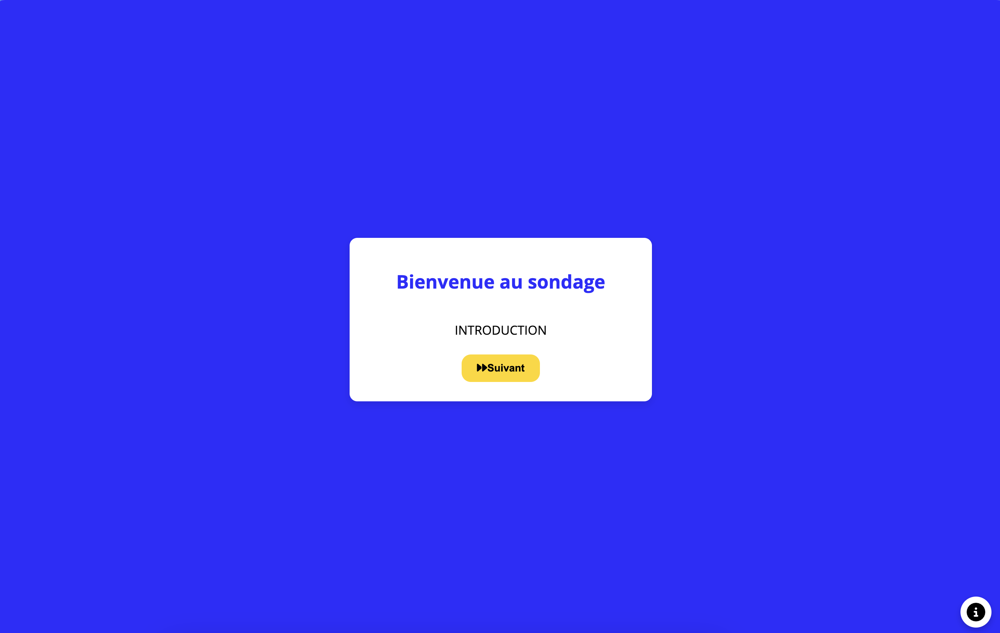
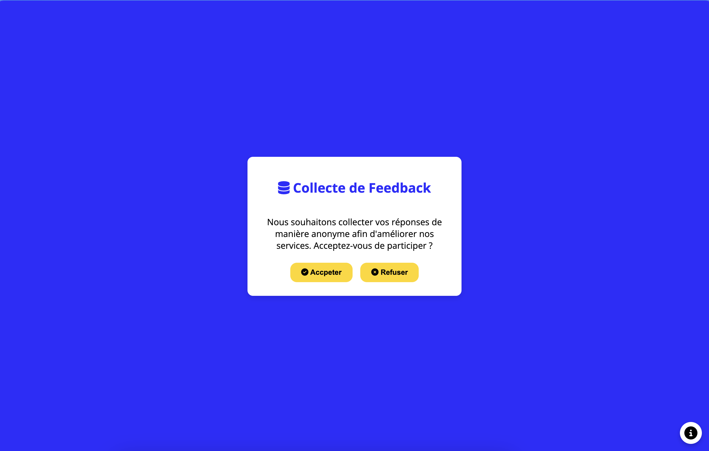

# Sondage Frontend 📊
> Système de sondage destiné à recueillir les retours et insights de vos clients de manière simple et efficace.

### Exemples :

### Collecte de Feedback 🗒️ :
- Sondages personnalisables
- Interface utilisateur simple et customisable (personnalisé vos sondages à vos goûts et les couleurs de votre entreprise).

### Avantages pour votre Entreprise 💡:
- Amélioration continue
- Engagement client renforcé
- Données stratégiques exploitables

### 🌐 Site internet :
- Commander : https://agence-prestige-numerique.fr/#contact
